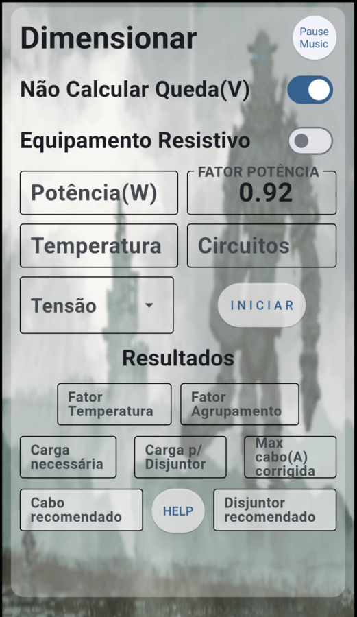

# Calculadora para saber a bitola de cabos 

## Apresentação 
 
Criei esse app para android afim de facilitar a consulta do tamanho da bitola a ser usada em uma instalação residencial.
Ele Dimensiona usando as normas da NBR 5410.

## COMO UTLIZAR 

Depois de instalado no seu celular , basta abrir e aguardar a tela inicial. 



Clic em PAUSE MUSIC para dar STOP ou PLAY na musica de fundo.

Agora informe:
potência total da carga em watts,
fator de potência,
temperatura,
quantidade de circuitos agrupados no mesmo eletroduto e
tensão a ser aplicada.

Escolha sim ou não em Calcular Queda.

Escolha entre risistivo ou não.

Clic em iniciar para exibir os resultados.

### RESULTADOS EXPLICADOS
🔹 Carga Necessária

Corrente real calculada da carga.

🔹 Carga p/ Disjuntor

Corrente com margem de segurança aplicada.

🔹 Fator Temperatura

Fator aplicado conforme tabela da NBR 5410.

🔹 Fator Agrupamento

Correção aplicada conforme quantidade de circuitos.

🔹 Max Cabo (A) Corrigida

Corrente máxima que o cabo suporta após correções.

🔹 Cabo Recomendado

Bitola mínima que atende:

Corrente

Temperatura

Agrupamento

Queda de tensão (se ativada)

🔹 Disjuntor Recomendado

Disjuntor comercial adequado conforme:

Corrente calculada

Proteção do cabo

Margem de segurança

## Como criar o arquivo APP usando o Flet

### Linux

```
flet com linux
```

For more details on building Linux package, refer to the [Linux Packaging Guide](https://flet.dev/docs/publish/linux/).

### Windows

```
flet com windows
```

For more details on building Windows package, refer to the [Windows Packaging Guide](https://flet.dev/docs/publish/windows/).
